# Cognitum Media — governed authority outside of code

A two-minute broadcast master, produced end to end by AI, in which the creative
models were never allowed to publish it.

This page is in Ruflo's docs for one reason: it is the clearest existing
demonstration of the pattern Ruflo is built around — **generation authority and
promotion authority are different things** — applied somewhere other than a
codebase. The same separation that stops an agent from self-merging a pull
request is what stops a generative model from putting itself on air.

[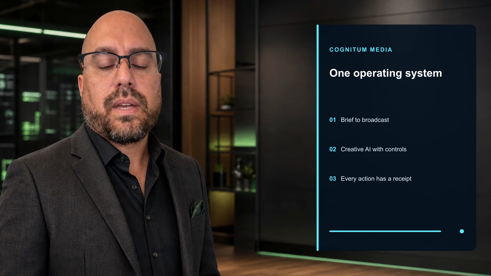](#watch-the-master)

---

## At a glance

| | |
|---|---|
| Title | *Cognitum Media in Motion* |
| Runtime | 125.67 s delivered (134 s nominal, before transition overlap) |
| Video | H.264, 1920×1080, 24 fps |
| Audio | AAC, 48 kHz, stereo |
| Master | 87,597,854 bytes |
| Scenes | 12 — 7 presenter, 5 generated interludes |
| Presenters | 4 variants from 1 consented likeness |
| Styles | 7 (nightly news, movie trailer, product launch, realistic cinematic, graphic illustration, editorial cartoon, documentary) |
| Provider steps | 33 |
| Estimated cost | $12.94 against a $20 declared cap |
| Final state | `awaiting_approval` — publication unauthorized |

**Objective, as declared in the spec:** *"Create an action paced cinematic
demonstration of the complete governed Cognitum Media system with an improved
rUv avatar, precise lip synchronization, right side feature graphics, real
examples, movie interludes, sound design, and approval ready evidence."*

---

## The production, scene by scene

Twelve scenes alternate a presenter against generated b-roll. Every scene
carries a feature panel on the right with a kicker, a headline, and three
concrete capabilities. Timings below are the **delivered** ones — the spec's
nominal 134 s becomes 125.67 s because each transition overlaps its neighbours.

### 1 · `cold_open` — One operating system
*Presenter (rUv) · nightly news · 0:00 → fadeblack 0.8s*

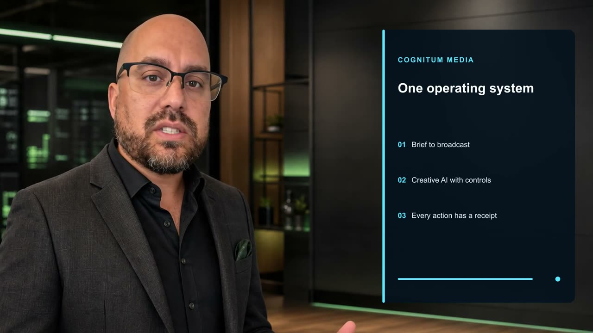

> I am rUv. This is Cognitum Media, one governed system for turning an approved
> idea into finished broadcast media.

Brief to broadcast · Creative AI with controls · Every action has a receipt

### 2 · `movie_mission` — See the whole production
*B-roll · movie trailer · 0:12 → smoothleft 0.85s*

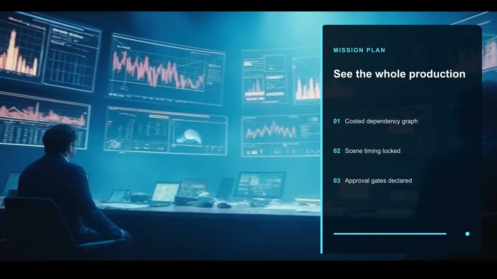

> The metaharness sees the whole mission before generation begins: story,
> styles, assets, timing, cost, and required controls.

Costed dependency graph · Scene timing locked · Approval gates declared

### 3 · `creator_console` — Start with what you have
*Presenter (rUv) · nightly news · 0:22 → dissolve 0.7s*

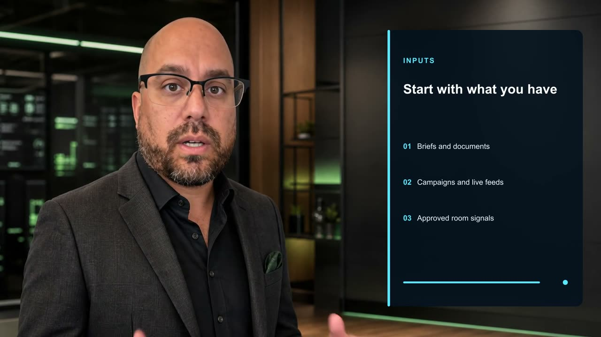

> Submit a campaign, document, live feed, or room signal. Cognitum converts it
> into a complete production plan.

Briefs and documents · Campaigns and live feeds · Approved room signals

### 4 · `examples` — Many formats. One core.
*B-roll · product launch · 0:34 → radial 0.75s*

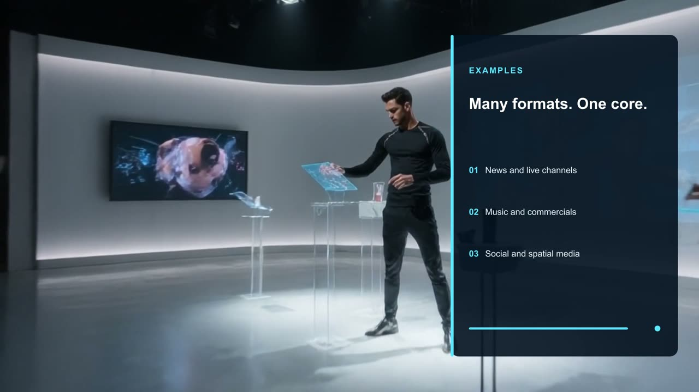

> The same foundation creates news packages, music videos, presenter explainers,
> commercials, social clips, and spatial experiences.

News and live channels · Music and commercials · Social and spatial media

### 5 · `female_anchor` — Change the presentation
*Presenter (female variant) · realistic cinematic · 0:44 → smoothright 0.7s*

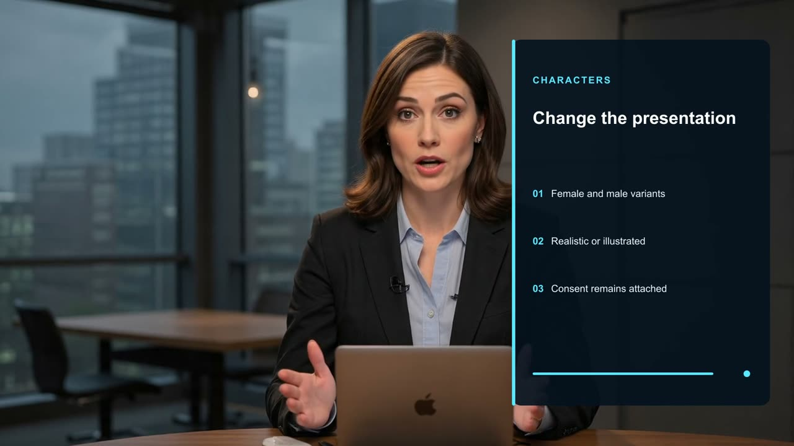

> One approved presenter can become a female anchor, male correspondent,
> realistic character, or illustrated host without losing governance.

Female and male variants · Realistic or illustrated · Consent remains attached

### 6 · `production_engine` — Generate with control
*B-roll · graphic illustration · 0:56 → circleopen 0.8s*

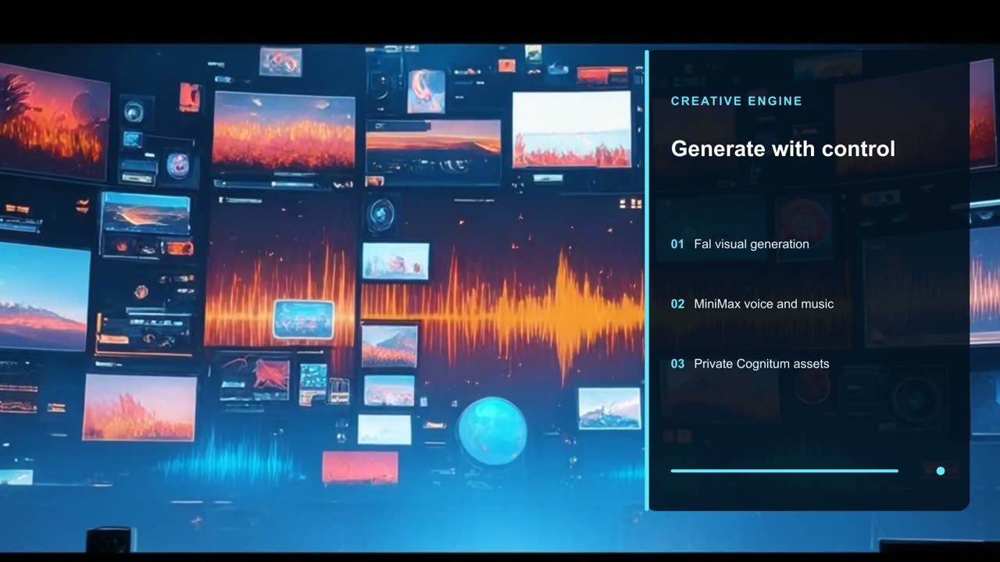

> Fal generates controlled visual assets and motion. MiniMax creates voice and
> music. Cognitum keeps the workflow coherent.

Fal visual generation · MiniMax voice and music · Private Cognitum assets

### 7 · `field_host` — Remix without rebuilding
*Presenter (male variant) · realistic cinematic · 1:06 → smoothup 0.7s*

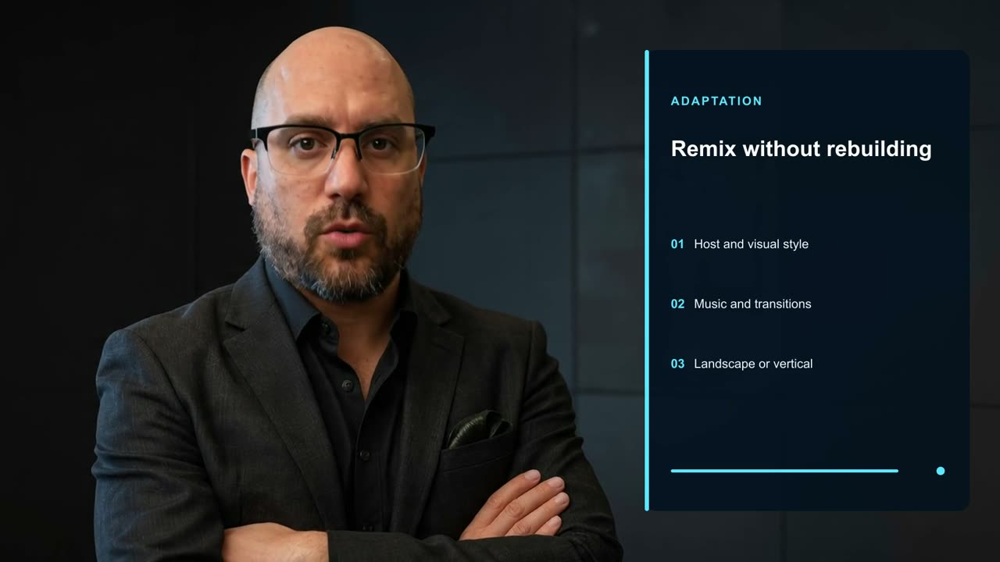

> Change the host, visual language, transition, music treatment, or channel
> format while the production remains reproducible.

Host and visual style · Music and transitions · Landscape or vertical

### 8 · `action_network` — Run the full channel
*B-roll · movie trailer · 1:18 → fadeblack 0.9s*

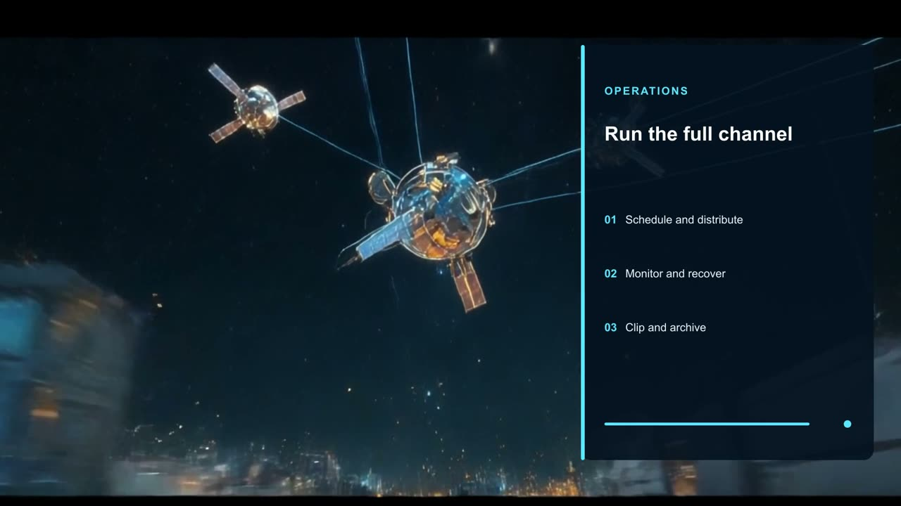

> Approved software schedules the program, sends it to destinations, watches
> stream health, recovers failures, and archives every result.

Schedule and distribute · Monitor and recover · Clip and archive

### 9 · `cartoon_mode` — Creative does not mean loose
*Presenter (cartoon variant) · editorial cartoon · 1:28 → dissolve 0.7s*

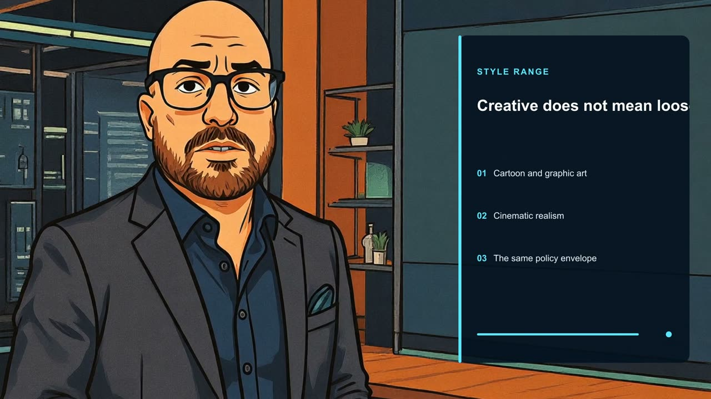

> The style can shift completely. Editorial animation still carries the same
> consent, provenance, spending limit, and approval policy.

Cartoon and graphic art · Cinematic realism · The same policy envelope

> **Note:** this frame also shows the one rendering defect in the master — the
> headline is clipped to *"Creative does not mean loos"*. See
> [Known defect](#known-defect).

### 10 · `edit_suite` — Picture and sound aligned
*B-roll · documentary · 1:40 → smoothdown 0.7s*

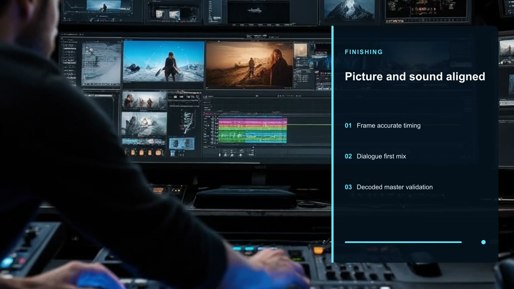

> The finishing system aligns every cut, holds lip sync, mixes effects, ducks
> music, and validates the decoded master.

Frame accurate timing · Dialogue first mix · Decoded master validation

### 11 · `authority` — Authority stays separate
*Presenter (rUv) · nightly news · 1:50 → smoothleft 0.75s*

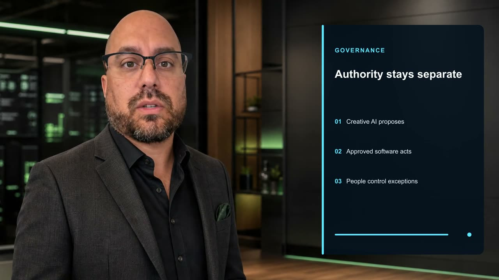

> Creative AI cannot publish, spend freely, choose advertising, alter emergency
> text, or take control of a broadcast.

Creative AI proposes · Approved software acts · People control exceptions

### 12 · `finale` — Ready for approval
*Presenter (rUv) · nightly news · 2:02 → fade 0.8s*

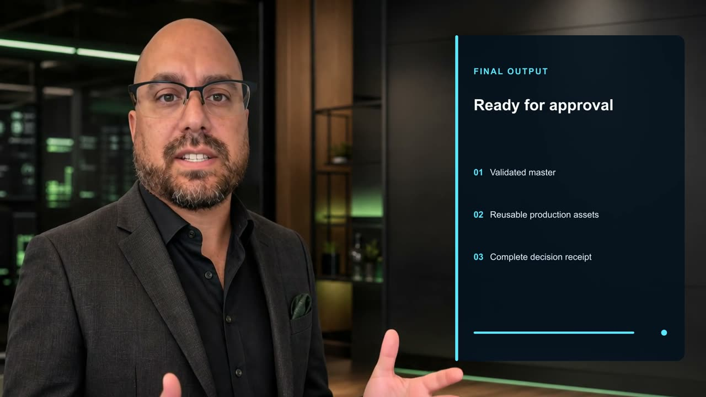

> Cognitum Media delivers a validated master, reusable assets, and a receipt for
> every decision. Creation moves fast. Control remains human.

Validated master · Reusable production assets · Complete decision receipt

### All twelve at once

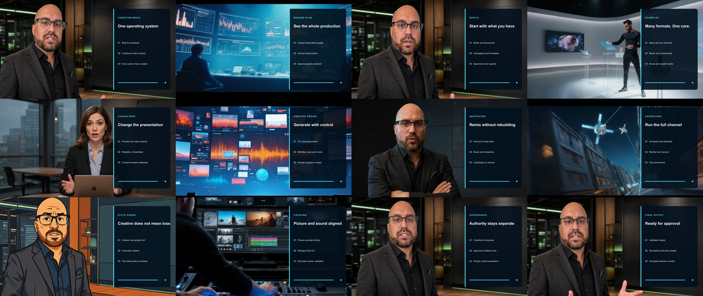

---

## The part that matters to Ruflo

The creative providers had **generation authority only**. Across the entire run
they could not:

- publish or schedule the output
- deploy it to any destination
- select advertising
- alter ticker or emergency text
- take control of a live broadcast
- mutate billing, or spend past the declared cap

The run terminated at `awaiting_approval` with `publication_authorized: false`.
Producing a finished, validated, broadcast-ready master and *still* not being
allowed to release it is the entire point — the same shape as an evaluation
receipt in `@dream-machine/witness` that carries `authority: 'none'`, or a Ruflo
agent that can propose a change but not merge it.

```json
"governance": {
  "approval_required": true,
  "publication_authorized": false,
  "approved_max_cost_usd": 20,
  "allow_personal_likeness": true
}
```

### Consent travels with the likeness, not the render

One recorded attestation — *"The presenter and rights holder authorizes Cognitum
to use this likeness and stored voice alias for this production"* — covers all
four presenters. The male, female and cartoon variants are derived from the same
approved appearance asset and share a single `voice_alias`:

| Character | Kind | Direction |
|---|---|---|
| `ruv` | original | the approved presenter |
| `ruv_male` | male | confident cinematic field correspondent, tailored black broadcast wardrobe |
| `ruv_female` | female | polished female technology anchor, premium newsroom wardrobe |
| `ruv_cartoon` | cartoon | editorial graphic art with expressive linework |

Changing the presentation does not shed the policy envelope. That is the claim
scene 9 is making, and it is enforced in the spec rather than asserted in the
script.

### Audio is mastered to declared targets, not to taste

| Setting | Value |
|---|---|
| Dialogue target | −16 LUFS |
| True peak ceiling | −1.5 dBTP |
| Music ducking under dialogue | 20 dB |
| Score | 112 bpm, used as stings |

Pronunciation is pinned in the spec too (`rUv` → "roove", `Cognitum` → "cog nee
tum"), so voice generation cannot quietly drift on proper nouns.

---

## Verification

Every number on this page was checked against the artifacts rather than taken
from the production notes.

```console
$ shasum -a 256 -c SHA256SUMS
production-spec.json: OK
ultimate_cognitum_media_v2_final-contact.png: OK
ultimate_cognitum_media_v2_final-poster.png: OK
ultimate_cognitum_media_v2_final-validation.json: OK
ultimate_cognitum_media_v2_final.mp4: OK
ultimate_cognitum_media_v2_final.vtt: OK
```

`ffprobe` on the master independently confirms the codec, resolution, frame
rate, sample rate, channel count, duration and byte size claimed above. The
decoded validation receipt reports:

| Check | Result |
|---|---|
| `passed` | true |
| Decoded frames | 3,016 (floor: 2,992) |
| Black intervals | 0 |
| Freeze intervals | 0 |
| Mean audio | −20.5 dB |
| Peak audio | −1.5 dB |
| Consent recorded | true |
| Publication authorized | **false** |

Two caveats carried over from the source notes, preserved rather than rounded
away: the cost is a **bounded estimate, not an invoice** — the provider API did
not reconcile a billed figure — and captions ship as a WebVTT sidecar rather
than burned into the picture.

---

## Known defect

Scene 9's panel headline is specified as *"Creative does not mean loose"* but
renders in the master as **"Creative does not mean loos"**.

It is the longest headline in the production at 28 characters; every other panel
is 25 characters or fewer and renders intact. That points at a fixed-width
truncation in the overlay renderer rather than a content error in the spec. The
defect is baked into the delivered master, so it needs a re-render to fix — it
is left visible here rather than cropped out.

---

## Reproduce

```bash
npm run media -- plan production/cognitum-media-ultimate-v2/production-spec.json

COGNITUM_MEDIA_API_URL=https://your-gateway.example \
COGNITUM_MEDIA_API_KEY=cog_scoped_key \
npm run media -- run production/cognitum-media-ultimate-v2/production-spec.json --confirm-spend
```

Acceptance: `ultimate_cognitum_media_v2_final-validation.json` reports `passed:
true`, at least 2,992 decoded frames, audio present, and zero black and freeze
intervals.

---

## Watch the master

The 84 MB master is deliberately **not** committed to this repository. It ships
with the production artifacts:

```
cognitum-media-factory/production/cognitum-media-ultimate-v2/
├── ultimate_cognitum_media_v2_final.mp4          # 84 MB master
├── ultimate_cognitum_media_v2_final.vtt          # caption sidecar
├── ultimate_cognitum_media_v2_final-validation.json
├── ultimate_cognitum_media_v2_final-poster.png
├── ultimate_cognitum_media_v2_final-contact.png
├── production-spec.json
└── SHA256SUMS
```

<!-- Replace this block with the hosted player URL once the master is published. -->

Output formats declared in the spec: `mp4`, `poster`, `vtt` → `artifacts/ultimate-cognitum-media-v2`.
